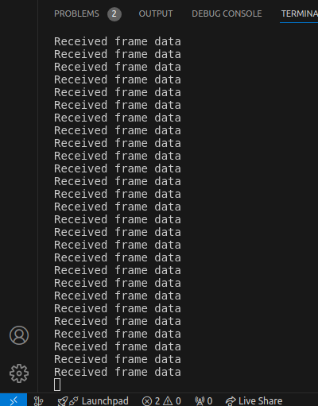
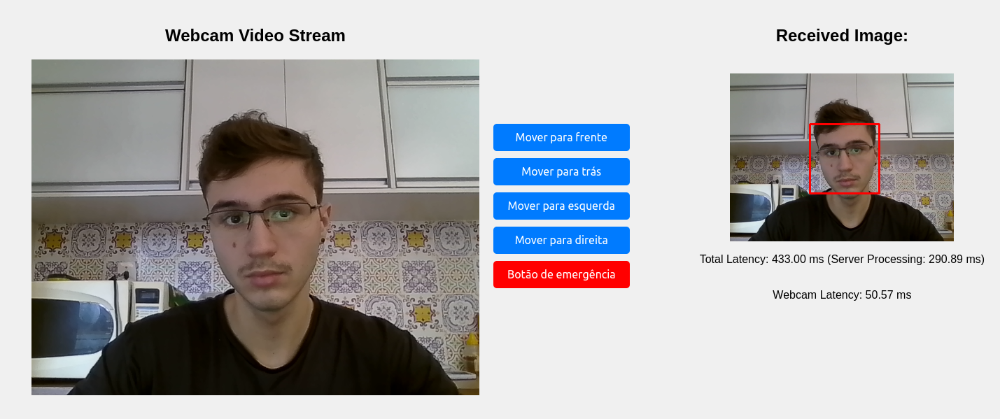
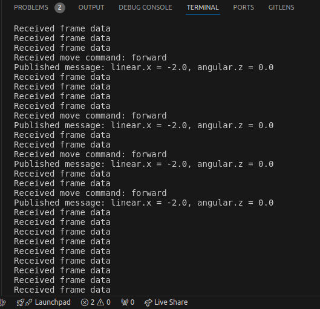
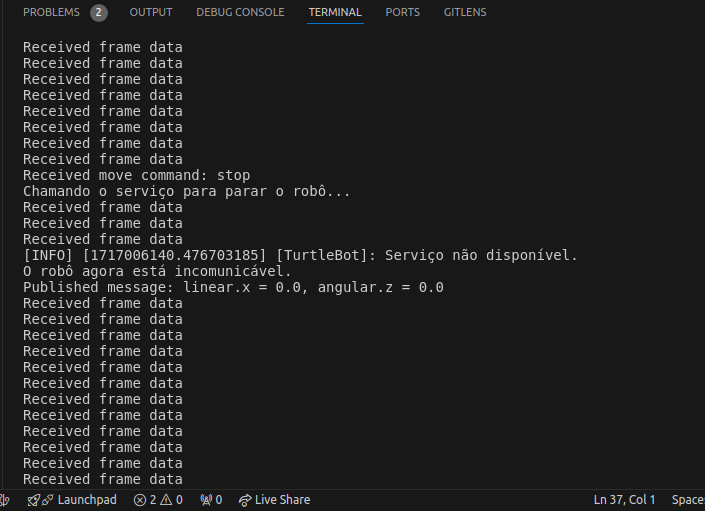

# Sumário

- [Atividade ponderada semana 05](#atividade-ponderada-semana-05)
  - [Aviso](#aviso)
  - [Tentando ir além](#tentando-ir-além)
  - [Configuração do ambiente virtual para rodar a atividade](#configuração-do-ambiente-virtual-para-rodar-a-atividade)
  - [Rodando meu servidor em seu computador](#rodando-meu-servidor-em-seu-computador)
  - [Explicação do código e suas principais funções dentro do servidor (arquivo main.py)](#explicação-do-código-e-suas-principais-funções-dentro-do-servidor-arquivo-mainpy)
    - [Imports](#imports)
    - [Definindo Rotas e Eventos](#definindo-rotas-e-eventos)
    - [Recepção e manuseio das imagens](#recepção-e-manuseio-das-imagens)
    - [Resumo](#resumo)
    - [Interação com o Robô](#integração-com-o-robô)
  - [Iniciaçização do servidor](#inicialização-do-servidor)
- [HTMl e JS utilizados (não vou incluir o CSS mas ele existe para o básico da estilização)](#html-e-js-utilizados-não-vou-incluir-o-css-mas-ele-existe-para-o-básico-da-estilização)
  - [HTML](#html)
    - [index.html](#indexhtml)
    - [dois.html](#doishtml)
  - [JS](#js)
- [Vídeo e screenshots para comprovar o funcionamento da atividade](#vídeo-e-screenshots-para-comprovar-o-funcionamento-da-atividade)

# Atividade ponderada semana 05

&emsp;Objetivo: Construir uma interface gráfica e integrar uma câmera que pass pelo backend e retorna para o cliente, exibindo a latencia, taxa de processamento e taxa de transmissão de imagens.

#### Aviso: 

&emsp;Para melhorar o desempenho da latencia ao executar o script da atividade gravei pelo meu celular a comprovação e utilizei prints tambem, pois ao gravar a tela do computador enquanto o script rodava a latencia quase que dobrava e isso impactava no desempenho.

#### Tentando ir além:

&emsp;O objetivo da atividade era fazer a transmissão da image da camera via websocket e mostrar o tempo de processamento. Tentei implementar em meu sistema um identifiador de rostos humanos, vimos isso na aula ministrada pelo professor Murilo e pensei por que não tentar... Bom, confira abaixo o resultado dessa tentativa rsrsrs

&emsp;Utilizei esses dois dataset's para implementar essa parte da atividade:

1 - `haarcascade_frontalface_default.xml` --> Utilizado para identifcar rostos frontalmente

2 - `haarcascade_profileface.xml` --> Utilizado para identificar rostos de perfil (de lado)

&emsp;Combinei os dois para uma melhor identificação facial na ativiade, tant frontalmente quanto de lado.

# Configuração do ambiente virtual para rodar a atividade:

&emsp;Primeiro você deve clonar em sua máquina meu repositório, escolha uma pasta como por exemplo `Documents` e navegue até ela no terminal, em seguida digite `git clone https://github.com/Rizzi26/Atividades-ponderadas-M6`.

&emsp;Agora com o repositório clonado ative a o ambiente virtual do python em sua máquina `venv`, digite o seguinte comando `python3 -m venv venv` e ative o ambiente virtual logo em seguida com o comando `source ./venv/bin/activate`

&emsp;E por fim, instale as dependências necessárias que utilizei nas importações com o comando `python3 -m pip install -r requirements.txt`

# Rodando meu servidor em seu computador:

&emsp;Agora com a venv ativada em sua máquina, navegue até o diretório `.../Atividades-ponderadas-M6/semana-07/src` e rode o seguinte comando para levantar o servidor `python3 main.py`

# Explicação do código e suas principais funções dentro do servidor (arquivo main.py):

### Imports:

&emsp;Aqui podemos observar os imports realizados em meu código para o seu funcionamento:

```python 
# imports para processar as imagens e controlar o robô
import cv2
import numpy
from flask import Flask, render_template
from flask_socketio import SocketIO, emit
from PIL import Image, ImageOps
import io
import base64
from geometry_msgs.msg import Twist
from rclpy.node import Node
import rclpy
from std_srvs.srv import Empty
from concurrent.futures import ThreadPoolExecutor
import time
```

&emsp;Este trecho de código configura o servidor web Flask, inicializa o Socket.IO para comunicação em tempo real, e define um executor de pool de threads para processamento assíncrono de tarefas.

```python 
# Configuração da aplicação Flask e inicialização do servidor Socket.IO
app = Flask(__name__, template_folder='templates')
app.config['SECRET_KEY'] = 'secret!'
socketio = SocketIO(app, async_mode='threading')

# Criação de executor de pool de threads para processamento assíncrono
executor = ThreadPoolExecutor(max_workers=4)
```

### Definindo Rotas e Eventos:

```python
# Rota principal da aplicação
@app.route('/')
def index():
    return render_template('index.html')

# Função para lidar com mensagens WebSocket recebidas
@socketio.on('message')
def handle_message(data):
    print(f'received message: {data}')
    emit('response', {'data': f'Server received: {data}'}, broadcast=True)

# Função para lidar com comandos de movimento WebSocket recebidos
@socketio.on('move')
def handle_move(data):
    direction = data['direction']
    print('Received move command:', direction)
    turtle_bot.handle_move(direction)
```

1 - **Rota Principal**:
- `app.route('/'):` Define a rota principal do aplicativo.
- `def index():` Função associada à rota principal.
- `return render_template('index.html'):` Renderiza o template HTML index.html quando a rota principal é acessada.

2 - **Manuseio de Mensagens**:
- `@socketio.on('message'):` Define um evento WebSocket para mensagens com o identificador 'message'.
- `def handle_message(data):` Função que lida com a recepção de mensagens.
- `print(f'received message: {data}'):` Imprime a mensagem recebida no console.
- `emit('response', {'data': f'Server received: {data}'}, broadcast=True):` Envia uma resposta para todos os clientes conectados, indicando que o servidor recebeu a mensagem.

3 - **Manuseio de Movimentos**:
- `@socketio.on('move'):` Define um evento WebSocket para comandos de movimento com o identificador 'move'.
- `def handle_move(data):` Função que lida com comandos de movimento.
- `direction = data['direction']:` Extrai a direção do comando de movimento dos dados

&emsp;Recepção e manuseio das **imagens**:

```python
# Função para lidar com dados de quadro WebSocket recebidos
@socketio.on('frame')
def handle_frame(data):
    print("Received frame data")
    
    # Marca o tempo de início do processamento
    start_time = time.time()
    received_timestamp = data['timestamp']

    # Função interna para processar a imagem de forma assíncrona
    def process_image(image_data):
        decode_start_time = time.time()
        # Decodifica a imagem em base64
        image_data = base64.b64decode(image_data.split(',')[1])
        image = Image.open(io.BytesIO(image_data))
        decode_end_time = time.time()

        # Redimensiona a imagem para metade do tamanho original
        image = ImageOps.fit(image, (image.width // 2, image.height // 2))

        # Identifica rostos na imagem
        face_detection_start_time = time.time()
        image_base64 = identify_faces(image)
        face_detection_end_time = time.time()
        
        return image_base64, decode_end_time - decode_start_time, face_detection_end_time - face_detection_start_time

    image_data = data['image']
    # Submete o processamento da imagem para execução assíncrona
    future = executor.submit(process_image, image_data)
    image_base64, decode_time, face_detection_time = future.result()
    
    # Calcula o tempo total de processamento
    total_time = time.time() - start_time

    # Emite a resposta com a imagem processada e informações de tempo
    emit('image_response', {
        'image': f'data:image/png;base64,{image_base64}',
        'received_timestamp': received_timestamp,
        'received_time': start_time,
        'sent_time': time.time(),
        'total_time': total_time,
        'decode_time': decode_time,
        'face_detection_time': face_detection_time
    }, broadcast=True)

# Função para identificar rostos na imagem
def identify_faces(image):
    classificador = cv2.CascadeClassifier('haarcascade_frontalface_default.xml')
    classificador2 = cv2.CascadeClassifier('haarcascade_profileface.xml')

    image = numpy.array(image)
    gray = cv2.cvtColor(image, cv2.COLOR_BGR2GRAY)
    faces = classificador.detectMultiScale(gray, 1.3, 5)
    for (x, y, w, h) in faces:
        cv2.rectangle(image, (x, y), (x + w, y + h), (255, 0, 0), 2)
    image = cv2.cvtColor(image, cv2.COLOR_BGR2RGB)
    image_face = Image.fromarray(image)

    image_face = numpy.array(image_face)
    gray = cv2.cvtColor(image_face, cv2.COLOR_BGR2GRAY)
    faces = classificador2.detectMultiScale(gray, 1.3, 5)
    for (x, y, w, h) in faces:
        cv2.rectangle(image_face, (x, y), (x + w, y + h), (0, 255, 0), 2)
    image_face = cv2.cvtColor(image_face, cv2.COLOR_BGR2RGB)
    image_face = Image.fromarray(image_face)

    buffered = io.BytesIO()
    image_face.save(buffered, format="PNG", optimize=True)
    image_base64 = base64.b64encode(buffered.getvalue()).decode('utf-8')
    return image_base64
```

1 - **Recepção de Dados de Quadro**:
- `@socketio.on('frame'):` Define um evento WebSocket para dados de quadro com o identificador 'frame'.
- `def handle_frame(data):` Função que lida com a recepção de dados de quadro.
- `print("Received frame data"):` Imprime uma mensagem no console ao receber dados de quadro.
- `start_time = time.time():` Marca o tempo de início do processamento.
- `received_timestamp = data['timestamp']:` Obtém o timestamp do dado recebido.

2 - **Processamento da Imagem**:
- `def process_image(image_data):` Define uma função interna para processar a imagem.
- `image_data = base64.b64decode(image_data.split(',')[1]):` Decodifica a imagem em base64.
- `image = Image.open(io.BytesIO(image_data)):` Abre a imagem decodificada.
- `image = ImageOps.fit(image, (image.width // 2, image.height // 2)):` Redimensiona a imagem para metade do tamanho original.
- `image_base64 = identify_faces(image):` Identifica rostos na imagem e retorna a imagem processada em base64.

3 - **Execução Assíncrona**:
- `future = executor.submit(process_image, image_data):` Submete o processamento da imagem para execução assíncrona.
- `image_base64, decode_time, face_detection_time = future.result():` Obtém o resultado do processamento.

4 - **Emissão de Resposta**:
- `emit('image_response', { ... }, broadcast=True):` Emite a imagem processada e os tempos de processamento de volta para todos os clientes conectados.

5 - **Identificação de Rostos**:
- `def identify_faces(image):` Função que detecta rostos na imagem usando classificadores Haar.
-` classificador = cv2.CascadeClassifier('haarcascade_frontalface_default.xml'):` Carrega o classificador para rostos frontais.
- `classificador2 = cv2.CascadeClassifier('haarcascade_profileface.xml'):` Carrega o classificador para perfis de rosto.
- `faces = classificador.detectMultiScale(gray, 1.3, 5):` Detecta rostos na imagem em escala de cinza.
- `cv2.rectangle(image, (x, y), (x + w, y + h), (255, 0, 0), 2):` Desenha retângulos ao redor dos rostos detectados.
- `buffered = io.BytesIO():` Salva a imagem processada em um buffer.
- `image_base64 = base64.b64encode(buffered.getvalue()).decode('utf-8'):` Converte a imagem processada para base64.

### Resumo

&emsp;Este código define um evento WebSocket para processar dados de quadros recebidos, decodificando a imagem, redimensionando-a, detectando rostos, e enviando a imagem processada de volta aos clientes. O processamento da imagem é realizado de forma assíncrona para melhorar a eficiência.

### Interação com o Robô:

```python
class TurtleBot(Node):
    # Inicializa o nó do robô TurtleBot
    def __init__(self):
        super().__init__('TurtleBot')
        # Define o estado de conexão como True
        self.connected = True
        # Cria um publicador para o tópico 'cmd_vel'
        self.publisher_ = self.create_publisher(Twist, 'cmd_vel', 10)
        # Define a velocidade linear e angular padrão
        self.linear_speed = 2.0
        self.angular_speed = 2.0
        # Define o estado do robô como não parado
        self.stopped = False

    # Função para lidar com os movimentos do robô
    def handle_move(self, direction):
        # Verifica se o robô está parado
        if self.stopped:
            print("O robô está parado e não aceitará mais comandos.")
            return

        # Cria uma mensagem Twist para enviar comandos de velocidade
        msg = Twist()
        # Seleciona a ação com base na direção recebida
        match direction:
            case 'forward':
                msg.linear.x = -self.linear_speed
            case 'backward':
                msg.linear.x = self.linear_speed
            case 'left':
                msg.angular.z = self.angular_speed
            case 'right':
                msg.angular.z = -self.angular_speed
            case 'stop':
                self.stop()
        # Publica a mensagem com os comandos de velocidade
        self.publisher_.publish(msg)
        print(f'Published message: linear.x = {msg.linear.x}, angular.z = {msg.angular.z}')

    # Função para parar o robô
    def stop(self):
        print("Chamando o serviço para parar o robô...")
        # Cria um cliente para chamar o serviço 'stop_robot'
        client = self.create_client(Empty, 'stop_robot')
        # Aguarda até que o serviço esteja disponível
        if client.wait_for_service(timeout_sec=0.1):
            request = Empty.Request()
            future = client.call_async(request)
            # Mantém o nó em execução até que a chamada do serviço seja concluída
            rclpy.spin_until_future_complete(self, future)
            self.get_logger().info('Serviço chamado com sucesso.')
        else:
            self.get_logger().info('Serviço não disponível.')

        # Define o estado do robô como parado
        self.stopped = True
        print("O robô agora está incomunicável.")
```

1 - **Classe TurtleBot**:
- `class TurtleBot(Node):` Define a classe TurtleBot, que herda da classe Node do ROS2.
- `def __init__(self):` Construtor da classe.
- `super().__init__('TurtleBot'):` Inicializa o nó ROS2 com o nome TurtleBot.
- `self.connected = True:` Indica se o robô está conectado.
- `self.publisher_ = self.create_publisher(Twist, 'cmd_vel', 10):` Cria um publicador para o tópico cmd_vel com o tipo de mensagem Twist.
- `self.linear_speed = 2.0 e self.angular_speed = 2.0:` Define as velocidades linear e angular.
- `self.stopped = False:` Indica se o robô está parado.

2 - **Método handle_move**:
- `def handle_move(self, direction):` Lida com comandos de movimento.
- `if self.stopped:` Verifica se o robô está parado.
- `msg = Twist():` Cria uma mensagem Twist.
- `match direction:` Define a ação com base na direção fornecida.
- `'forward':` Move para frente.
- `'backward':` Move para trás.
- `'left':` Vira para a esquerda.
- `'right':` Vira para a direita.
- `'stop':` Chama o método stop para parar o robô.
- `self.publisher_.publish(msg):` Publica a mensagem no tópico cmd_vel.

3 - **Método stop**:
- `def stop(self):` Para o robô chamando um serviço ROS2.
- `client = self.create_client(Empty, 'stop_robot'):` Cria um cliente para o serviço stop_robot.
- `if client.wait_for_service(timeout_sec=0.1):` Espera pelo serviço com um timeout de 0.1 segundos.
- `request = Empty.Request():` Cria um pedido vazio.
- `future = client.call_async(request):` Chama o serviço de forma assíncrona.
- `rclpy.spin_until_future_complete(self, future):` Aguarda a conclusão da chamada do serviço.
- `self.get_logger().info('Serviço chamado com sucesso.'):` Loga que o serviço foi chamado com sucesso.
- `self.stopped = True:` Define o flag indicando que o robô está parado.

&emsp;Esta classe TurtleBot define um robô controlado via ROS2, com métodos para lidar com comandos de movimento (frente, trás, esquerda, direita, parar) e um método para parar o robô usando um serviço ROS2. A classe também gerencia o estado de conexão e se o robô está ou não aceitando comandos.

### Iniciaçização do servidor:

```python
# Verifica se o script está sendo executado como o programa principal
if __name__ == '__main__':
    # Inicializa o ROS 2
    rclpy.init()
    # Imprime uma mensagem de inicialização
    print("Initializing TurtleBot node")
    # Cria uma instância do TurtleBot
    turtle_bot = TurtleBot()
    try:
        # Inicia o servidor Socket.IO
        socketio.run(app)
    except KeyboardInterrupt:
        pass
    finally:
        # Destroi o nó do TurtleBot
        turtle_bot.destroy_node()
        # Desliga o ROS 2
        rclpy.shutdown()
```

&emsp;Este bloco de código inicializa o sistema ROS2 e o nó `TurtleBot`, e então executa o servidor WebSocket usando `socketio` para comunicação em tempo real. Em caso de interrupção (como um Ctrl+C), ele garante que o nó `TurtleBot` e o sistema ROS2 sejam corretamente encerrados.

# HTMl e JS utilizados (não vou incluir o CSS mas ele existe para o básico da estilização):

## HTML
### index.html:

```html
<!DOCTYPE html>
<html lang="en">
<head>
    <meta charset="UTF-8">
    <meta name="viewport" content="width=device-width, initial-scale=1.0">
    <title>Webcam Video Stream</title>
    <!-- Inclui a biblioteca Socket.IO -->
    <script src="https://cdnjs.cloudflare.com/ajax/libs/socket.io/4.0.0/socket.io.js"></script>
    <!-- Inclui o arquivo CSS para estilização -->
    <link rel="stylesheet" type="text/css" href="{{ url_for('static', filename='css/index.css') }}">
</head>
<body>
    <div class="main">
        <div class="container">
            <div class="video-container">
                <h2>Webcam Video Stream</h2>
                <!-- Tag de vídeo para exibir o stream da webcam -->
                <video id="video" width="640" height="480" autoplay></video>
            </div>
            <div class="controls">
                <!-- Botões para controlar o movimento do robô -->
                <button onclick="moveFoward()">Mover para frente</button>
                <button onclick="moveBackward()">Mover para trás</button>
                <button onclick="moveLeft()">Mover para esquerda</button>
                <button onclick="moveRight()">Mover para direita</button>
                <button class="emergency" onclick="stop()">Botão de emergência</button>
            </div>
        </div>
        <div class="controls2">
            <!-- Elemento para exibir a imagem recebida -->
            <h2>Received Image:</h2>
            
            <!-- Elementos para exibir a latência -->
            <p id="latency">Latency: N/A</p>
            <p id="webcamLatency">Webcam Latency: N/A</p>
        </div>
    </div>
    <!-- Inclui o arquivo JavaScript para lidar com o WebSocket -->
    <script src="{{ url_for('static', filename='js/websocket.js') }}"></script>
</body>
</html>
```

&emsp;Configura uma página mais complexa com um stream de vídeo da webcam e controles para movimentar um robô. Inclui botões para enviar comandos de movimento e uma seção para exibir imagens processadas e informações de latência.

### dois.html:

```html
<!DOCTYPE html>
<html>
<head>
    <title>WebSocket Video Stream</title>
    <!-- Inclui a biblioteca Socket.IO -->
    <script src="https://cdnjs.cloudflare.com/ajax/libs/socket.io/4.0.0/socket.io.js"></script>
    <script type="text/javascript">
        document.addEventListener('DOMContentLoaded', function () {
            // Conecta ao namespace '/video'
            var socket = io('/video');

            // Recebe os frames de vídeo e atualiza a imagem
            socket.on('video_frame', function (data) {
                console.log('Frame Recebido!');
                var img = document.getElementById('videoFrame');
                img.src = 'data:image/jpeg;base64,' + data.data;
            });

            // Recebe o sinal de término do vídeo
            socket.on('video_end', function (data) {
                console.log(data.data);
            });
        });
    </script>
</head>
<body>
    <!-- Elemento para exibir o frame de vídeo -->
    
    <!-- Título para o streaming de vídeo -->
    <h2>Streaming Video</h2>
</body>
</html>
```

&emsp;Configura uma página simples para receber e exibir frames de vídeo via WebSocket, com um elemento img que é atualizado com os frames recebidos.

## JS

&emsp;Este script JavaScript é responsável por interagir com o servidor via WebSocket para transmitir vídeo da webcam, processar os frames recebidos pelo servidor e enviar comandos de movimento para controlar um robô.

```JavaScript
// Conecta ao servidor WebSocket
var socket = io.connect('http://' + document.domain + ':' + location.port);

// Elementos do vídeo e do canvas
var video = document.getElementById('video');
var canvas = document.createElement('canvas');
var context = canvas.getContext('2d');

// Recebe e processa a resposta do servidor
socket.on('image_response', function(data) {
    console.log('Image received from server');
    var imageElement = document.getElementById('receivedImage');
    imageElement.src = data.image;

    // Calcula latências
    var sentTimestamp = data.received_timestamp;
    var receivedByServerTime = data.received_time * 1000; 
    var sentBackTime = data.sent_time * 1000; 
    var now = new Date().getTime(); 

    var totalLatency = now - sentTimestamp;
    var serverProcessingTime = sentBackTime - receivedByServerTime;
    var webcamLatency = receivedByServerTime - sentTimestamp;

    // Exibe latências na página
    document.getElementById('latency').innerText = `Total Latency: ${totalLatency.toFixed(2)} ms (Server Processing: ${serverProcessingTime.toFixed(2)} ms)`;
    document.getElementById('webcamLatency').innerText = `Webcam Latency: ${webcamLatency.toFixed(2)} ms`;
});

// Captura vídeo da webcam
navigator.mediaDevices.getUserMedia({ video: true })
    .then(function(stream) {
        video.srcObject = stream;
        video.play();
    })
    .catch(function(err) {
        console.error('Error accessing webcam: ' + err);
    });

// Envia frames para o servidor a cada 100ms
function sendFrame() {
    canvas.width = video.videoWidth;
    canvas.height = video.videoHeight;
    context.drawImage(video, 0, 0, canvas.width, canvas.height);
    var imageData = canvas.toDataURL('image/png');
    socket.emit('frame', { 'image': imageData, 'timestamp': new Date().getTime() });
}
setInterval(sendFrame, 100);  

// Funções para controlar movimento do robô
function moveFoward() {
    socket.emit('move', { 'direction': 'forward' });
}

function moveBackward() {
    socket.emit('move', { 'direction': 'backward' });
}

function moveLeft() {
    socket.emit('move', { 'direction': 'left' });
}   

function moveRight() {
    socket.emit('move', { 'direction': 'right' });
}

function stop() {
    socket.emit('move', { 'direction': 'stop' });
}
```

&emsp;Este script cria uma interação bidirecional entre a página HTML e o servidor, permitindo a transmissão de vídeo da webcam, o processamento dos frames pelo servidor e o controle de movimento do robô a partir da interface HTML.

# Vídeo e screenshots para comprovar o funcionamento da atividade:

&emsp;O vídeo foi gravado utilizando o meu celular, pois ao gravar a tela do computador comprometia a taxa de transmissão de quadros por segundo para o servidor

&emsp;Podemos observar que o robô responde aos comandos ao pressionarmos os botões de movimentação e ao pressionar o botão de emergência o robô não recebe mais nenhum comando dali em diante, pois seu serviço foi "morto"

[](https://www.youtube.com/watch?v=3Mv0G3BFd6Y)

&emsp;Como o vídeofoi gravado por uma camera externa (meu celular) tirei alguns prints enquanto o sistema era executado para melhor visualização:

&emsp;1 - Frame sendo recebido no backend:

<p align="center">
  
</p>

&emsp;2 - Frame sendo devolvido para o cliente de forma que captura rostos e mostra a latencia dos frames de entrada, de saída e o tempo de processamento: 

<p align="center">
  
</p>

&emsp;3 - Dados de movimentação recebidos pelo backend e executados pelo o Robô que escuta o nó:

<p align="center">
  
</p>

&emsp;4 - Botão de emergência "silenciando" o robô ao ser presssionado:

<p align="center">
  
</p>


